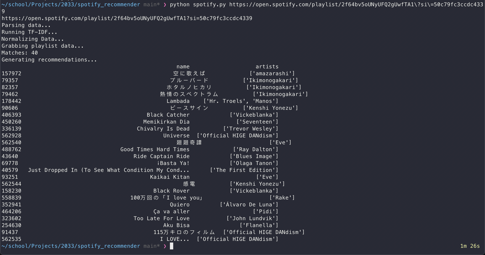

# Spotify Recommender

(https://open.spotify.com/playlist/2f64bv5oUNyUFQ2gUwfTA1?si=nif_aP2ZT2KAwoS7iptzKA)
## Getting Started
```
cd packages/backend/
unzip data.zip
rm data.zip
pip install spotipy
pip install numpy
pip install scikit-learn
pip install requests
```

## Running the program

```
python3 spotify.py [playlist_link_here]
```

## Important Information
- Dataset has 600k songs from 1920-2020 with data from Kaggle.
- The recommender does NOT put weight on date released for songs

